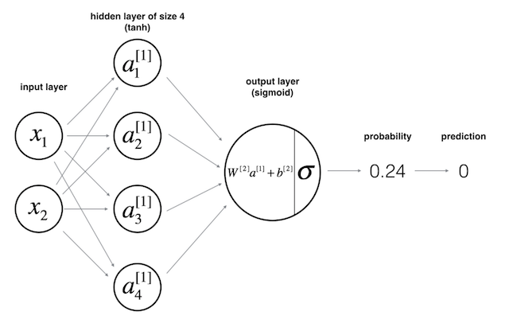

# CntkXOR
Simple MLP with CNTK on XOR dataset. The dataset can be loaded from an array or from a file.
Make sure having an NVIDIA GPU compatible with CUDA 10.0 with lastest drivers. All other versions of CUDA 9.X or 10.X arent working and only CUDA 10.0 is compatible with CNTK-GPU 2.6

The architecture of the deep neural network model :



Before the first compilation, all the nuget packages must being restored (right click on Solution from Solution-Explorer) and the selected Solution plateform must be x64.
This takes a little time to preparing more than 1Gb of dll dependencies, and the first compilation takes also a little time during copying all dll in the execution folder.

The output :

```
Device GPU[0] GeForce 930MX GPU[0]

Minibatch Epoch:     0 loss = 0.703728, acc = 0.5
Minibatch Epoch:    50 loss = 0.662360, acc = 0.75
Minibatch Epoch:   100 loss = 0.570215, acc = 0.75
Minibatch Epoch:   150 loss = 0.435425, acc = 0.75
Minibatch Epoch:   200 loss = 0.259464, acc = 1
Minibatch Epoch:   250 loss = 0.130447, acc = 1
Minibatch Epoch:   300 loss = 0.071931, acc = 1
Minibatch Epoch:   350 loss = 0.045891, acc = 1
Minibatch Epoch:   400 loss = 0.032406, acc = 1
Minibatch Epoch:   450 loss = 0.024463, acc = 1
Minibatch Epoch:   500 loss = 0.019336, acc = 1
Minibatch Epoch:   550 loss = 0.015802, acc = 1
Minibatch Epoch:   600 loss = 0.013245, acc = 1
Minibatch Epoch:   650 loss = 0.011326, acc = 1
Minibatch Epoch:   700 loss = 0.009842, acc = 1
Minibatch Epoch:   750 loss = 0.008666, acc = 1
Minibatch Epoch:   800 loss = 0.007717, acc = 1
Minibatch Epoch:   850 loss = 0.006937, acc = 1
Minibatch Epoch:   900 loss = 0.006287, acc = 1
Minibatch Epoch:   950 loss = 0.005738, acc = 1
Minibatch Epoch:  1000 loss = 0.005270, acc = 1

Prediction
[0 0] => 0 ~ 0.003580
[0 1] => 1 ~ 0.996067
[1 0] => 1 ~ 0.993500
[1 1] => 0 ~ 0.006977

End

```
